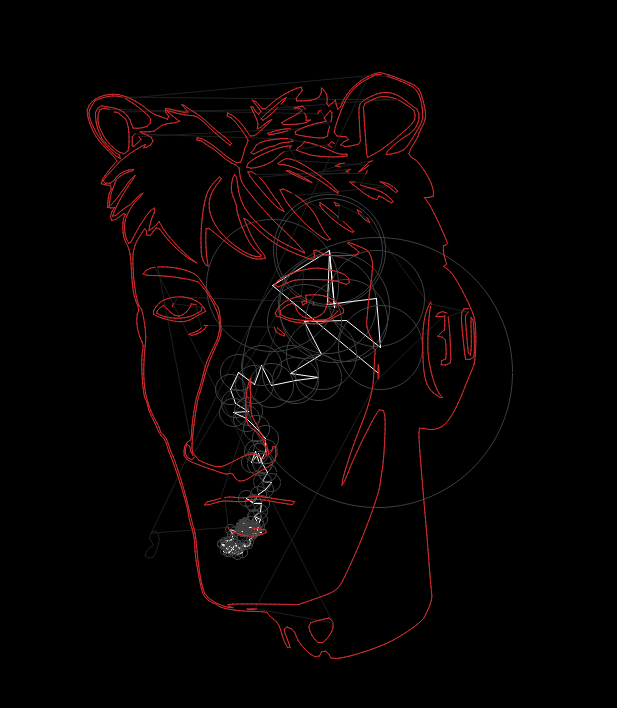

# FourierAnimation
Discrete Fourier Transform and Epicycle Art<br>
Original code : [hemang-pant/Fingerprint-compression-using-fourier-transform](https://github.com/hemang-pant/Fingerprint-compression-using-fourier-transform/tree/03d313af31623ad3dffca23455ceeecda210f421)



## How to Use
1. Convert SVG to Points (at [Here!](https://shinao.github.io/PathToPoints/))
2. Put point lists to Python.
3. Put point lists in `logo` argument of FourierAnimation (```FourierAnimation(logo=myPointList)```).
